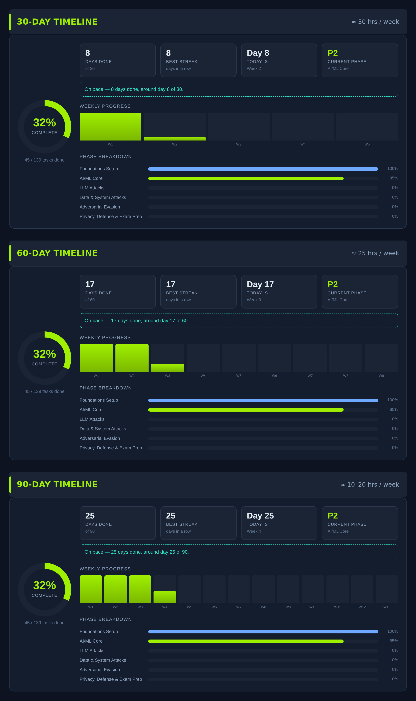

# COAE 90-Day Study Tracker

An interactive, offline-friendly study tracker for the **Hack The Box Certified Offensive AI Expert (HTB COAE)** certification.

It lays out a complete **90-day plan** through the [AI Red Teamer Job-Role Path](https://academy.hackthebox.com/path/preview/ai-red-teamer) — all 12 modules / 230 sections — and tracks your progress, notes, and pace as you go. The whole thing is a single self-contained HTML file: no build step, no dependencies, no internet required.



## Features

- **Day-by-day 90-day plan** — 13 weekly phases, from lab setup and AI/ML foundations through prompt injection, data attacks, adversarial evasion, AI privacy, and defense, ending with report-writing practice and a mock engagement.
- **Progress dashboard** — overall completion ring, days completed, best streak, current phase, a 13-week progress chart, per-phase breakdown, and an ahead/behind **pace indicator** based on your start date.
- **Notes & journal** — a collapsible notes field on every day to log what you learned, payloads that worked, and things to revisit.
- **Resource library** — 40+ curated links: official HTB modules, frameworks (OWASP LLM Top 10, MITRE ATLAS, Google SAIF, NIST AI RMF), Python/ML foundations, offensive AI tooling (garak, ART, PyRIT), practice playgrounds, and key adversarial-ML papers.
- **Local persistence** — all progress saves automatically to your browser's `localStorage`. Export/Import buttons let you back up or move your progress.

## Getting started

1. Clone the repo:
   ```bash
   git clone https://github.com/mattrfield/coae-90-day-tracker.git
   ```
2. Open `coae-90-day-tracker.html` in any modern browser (double-click it, or `File > Open`).
3. Set your **start date** at the top — every day's calendar date and your pace indicator are computed from it.
4. Tick tasks as you complete them. A day turns green when all its tasks are done.

No server, no install. It runs entirely in your browser.

> **Tip:** Progress is stored per-browser. Use the **Export backup** button regularly, and **Import** it if you switch browsers or machines. (Some browsers restrict `localStorage` on `file://` pages — if progress doesn't stick, exporting/importing is your reliable backup.)

## The plan at a glance

| Phase | Days | Focus |
|-------|------|-------|
| 1 | 1–7 | Foundations & lab setup (Python, ML intuition, security primer) |
| 2 | 8–28 | AI/ML core — *Fundamentals of AI*, *Applications of AI in InfoSec* |
| 3 | 29–49 | LLM attacks — *Red Teaming AI*, *Prompt Injection*, *LLM Output Attacks* |
| 4 | 50–63 | Data & system attacks — *AI Data Attacks*, *Attacking AI: Application & System* |
| 5 | 64–80 | Adversarial evasion — *Foundations*, *First-Order*, *Sparsity Attacks* |
| 6 | 81–90 | *AI Privacy*, *AI Defense*, report practice, mock engagement, exam prep |

The plan is tuned for roughly **10–20 hours per week** (~217 hours total) and assumes a foundations-level start in both offensive security and AI/ML.

## About the certification

The HTB COAE is earned by completing the AI Red Teamer Job-Role Path and passing a **7-day practical exam** in which you assess an AI-driven infrastructure and submit a commercial-grade technical report. Always confirm current module counts, exam format, and pricing on the [official HTB Academy site](https://academy.hackthebox.com/preview/certifications/htb-certified-offensive-ai-expert).

## Contributing

Issues and pull requests are welcome — improvements to the curriculum, resources, or UI are all fair game. Since the tracker is a single HTML file, edits are straightforward: the curriculum lives in the `CURRICULUM` array and resources in the `RESOURCES` array inside the `<script>` block.

## Disclaimer

This is an independent, community study aid. It is **not affiliated with, endorsed by, or sponsored by Hack The Box**. "Hack The Box" and "HTB" are trademarks of their respective owner.

## License

[MIT](LICENSE) — free to use, modify, and share.
